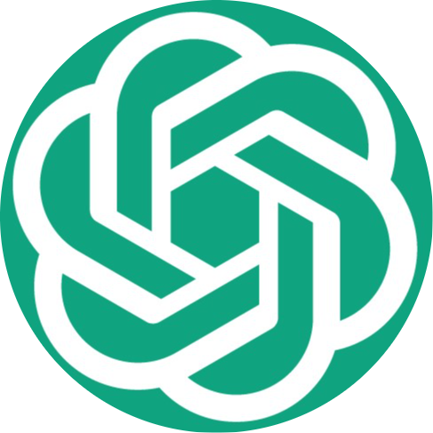
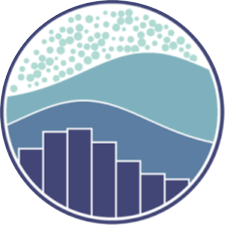
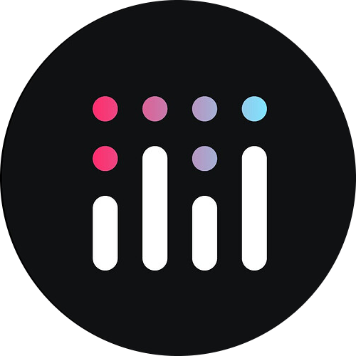
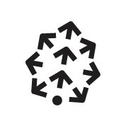

<h1 align="center"><b>Hello, I'm Sharath!</b></h1>

  <h1 align="center"><b>About Me</b></h1>
    <ul >
      <li>🔭 I am an AI Engineer embarking on a journey to unravel the intricacies of AI. </li> 
      <li>📚 My passion for math, science and problem solving drives me to seize every opportunity for learning, growth, and meaningful contributions.</li> 
      <li>🎯 With a background in crafting impactful deep learning models, applying robust data engineering principles, and harnessing the power of cloud computing technologies, my aim is to enhance the fabric of our daily lives.</li> 
      <li>🌈 The boundless possibilities presented by the continuous evolution of computer science have fueled my perpetual enthusiasm. I find joy in exploring new and innovative tech stacks, leveraging them as tools to craft exciting and impactful solutions.</li> 
    </ul>

<h1 align="center"><b>Tech Stack</b></h1>

<h3 align="Left"><b>Libraries</b></h3> 

  <a href="https://skillicons.dev" class="hover-container">
    
    OpenAI
  </a>
  <a href="https://skillicons.dev" class="hover-container">
    
    PyTorch
  </a>
  <a href="https://pandas.pydata.org//" class="hover-container">
    
    Pandas
  </a>
  <a href="https://scikit-learn.org/stable/" class="hover-container">
    
    Scikit-learn
  </a>
  <a href="https://www.svgrepo.com/" class="hover-container">
    
    NumPy
  </a>
  <a href="https://huggingface.co/" class="hover-container">
    
    Hugging Face
  </a>
  <a href="https://skillicons.dev" class="hover-container">
    
    TensorFlow
  </a>
  <a href="https://matplotlib.org" class="hover-container">
    
    Matplotlib
  </a>
  <a href="https://scipy.org" class="hover-container">
    
    SciPy
  </a>
  <a href="https://seaborn.pydata.org/" class="hover-container">
    
    Seaborn
  </a>
  <a href="https://opencv.org/" class="hover-container">
    
    OpenCV
  </a>
  <a href="https://skillicons.dev" class="hover-container">
    
    Plotly
  </a>
  <a href="https://skillicons.dev" class="hover-container">
    
    Spacy
  </a>
  <a href="https://skillicons.dev" class="hover-container">
    
    Web Sockets
  </a>

<h3 align="Left"><b>Languages</b></h3> 

  
    
    Python
  
  
    
    SQL
  
  
    
    Shell
  
  
    
    JavaScript
  
  
    
    HTML
  
  
    
    CSS
  

<h3 align="Left"><b>Frameworks</b></h3> 

  <a href="https://skillicons.dev" class="hover-container">
    
    LangChain
  </a>
  
    
    Flask
  
  
    
    Django
  
  
    
    FastAPI
  
  
    
    PySpark
  

<h3 align="Left"><b>Databases</b></h3> 

  
    
    Pinecone
  
  
    
    MongoDB
  
  
    
    PostgresDB
  
  
    
    SQLite
  
  
    
    MySQL
  
  
    
    Snowflake
  

<h3 align="Left"><b>Cloud and OS</b></h3> 

  <a href="https://skillicons.dev" class="hover-container">
    
    Amazon Web Services
  </a>
  <a href="https://skillicons.dev" class="hover-container">
    
    Microsoft Azure
  </a>
  <a href="https://skillicons.dev" class="hover-container">
    
    Linux
  </a>

<h3 align="Left"><b>Devops</b></h3> 

  <a href="https://skillicons.dev" class="hover-container">
    
    Docker
  </a>
  <a href="https://skillicons.dev" class="hover-container">
    
    Kubernetes
  </a>
  <a href="https://skillicons.dev" class="hover-container">
    
    Apache Kafka
  </a>
  <a href="https://airflow.apache.org/" class="hover-container">
    
    Apache Airflow
  </a>
  <a href="https://skillicons.dev" class="hover-container">
    
    RabbitMQ
  </a>
  <a href="https://skillicons.dev" class="hover-container">
    
    Git
  </a>
  <a href="https://skillicons.dev" class="hover-container">
    
    GitHub
  </a>

<h3 align="Left"><b>Tools</b></h3> 

&nbsp;&nbsp;
&nbsp;&nbsp;
&nbsp;&nbsp;
&nbsp;&nbsp;
&nbsp;&nbsp;

  

<h1 align="center"><b>Statistics</b></h1>
 
<table align="center" border="0">
  <tr>
    <th>
      
    </th>
    <th>
      
    </th>
</table>  

<h1 align="center"><b>Activity</b></h1> 

  

<h1 align="left"><b>Connect with me</b></h1> 

&nbsp;&nbsp;
&nbsp;&nbsp;
&nbsp;&nbsp;
&nbsp;&nbsp;

<i><b>~ Sharath<i><b>

